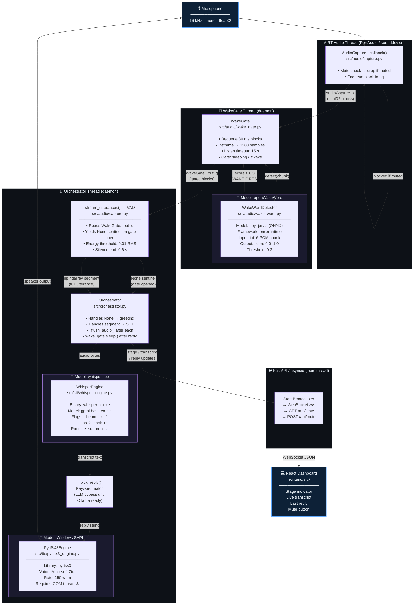

# Wake Word Detection — Architecture

> All components run fully on-device. Raw audio never leaves the machine.

---

## Block Diagram — Full System Flow



---

## Models at a Glance

| Role | Model / Engine | File | Size | Framework |
|---|---|---|---|---|
| **Wake word** | openWakeWord `hey_jarvis` | pre-trained (auto-download) | ~10 MB | ONNX Runtime |
| **Speech-to-Text** | whisper.cpp `ggml-base.en.bin` | `whisper-blas-x64/ggml-base.en.bin` | ~150 MB | whisper-cli subprocess |
| **Text-to-Speech** | Windows SAPI `Microsoft Zira` | built-in OS voice | 0 MB | pyttsx3 / SAPI5 |
| **LLM** *(pending)* | Ollama `llama3.2:3b` | auto-managed by Ollama | ~2 GB | Ollama HTTP API |
| **Embeddings** *(pending)* | Ollama `nomic-embed-text` | auto-managed by Ollama | ~280 MB | Ollama HTTP API |

> **LLM and Embeddings** are not active yet. Run `ollama pull llama3.2:3b` and `ollama pull nomic-embed-text` to enable full reasoning.

---

## Audio Pipeline — Step by Step

```
Microphone
    │  float32 blocks (1280 samples / 80 ms each)
    ▼
AudioCapture._q  ──────────────────────────────────────────────────
    │                                                              │
    ▼                                                             mute
WakeGate Thread                                               (dropped
    │  runs openWakeWord ONNX on each 80 ms chunk           in callback)
    │  if score ≥ 0.3 → gate opens
    ▼
WakeGate._out_q  (only flows when awake)
    │  float32 blocks
    ▼
stream_utterances() — VAD
    │  first block after gate opens → yields None  (sentinel)
    │  subsequent blocks → energy-based VAD
    │  0.6 s silence → yields np.ndarray segment
    ▼
Orchestrator (main thread)
    │  None  → pyttsx3.speak("How can I help you?") + _flush_audio()
    │  segment → WhisperEngine.transcribe() → _pick_reply() → pyttsx3.speak()
    │           → wake_gate.sleep() + _flush_audio()
    ▼
StateBroadcaster → WebSocket /ws → React Dashboard
```

---

## Modules Used

### 1. `src/audio/capture.py` — `AudioCapture`
**Library:** `sounddevice`, `numpy`

- Captures mic at **16 kHz mono float32** — openWakeWord's required format
- Block size: **80 ms = 1280 samples** — matches openWakeWord's native chunk (no reframing needed)
- `_callback()`: only does mute-check + enqueue. Zero inference here (PortAudio real-time thread)
- `stream_utterances()`: reads from `WakeGate._out_q` when gate is attached
  - Yields `None` sentinel when gate first opens (tells orchestrator to play greeting)
  - Yields `np.ndarray` utterance after 0.6 s silence

**Mute invariant:** when `hardware.muted` is True, blocks are dropped inside `_callback` before entering `_q`. No downstream code ever sees muted audio.

---

### 2. `src/audio/wake_gate.py` — `WakeGate`
**Library:** `threading`, `queue`, `numpy`

Daemon thread — gates audio between the mic queue and the VAD.

| State | What it does |
|---|---|
| **Sleeping** | Reads blocks from `_raw_q`, runs `WakeWordDetector.detect()` on each 80 ms chunk |
| **Awake** | Forwards all blocks straight to `_out_q` for the VAD |

Key behaviours:
- On wake detection: sets `_awake = True`, fires `_on_wake_handler()` callback, flushes stale audio from both queues, resets `awake_since` timer
- **Listen timeout:** 15 seconds — if no speech detected after wake, calls `sleep()` automatically
- `sleep()` called by orchestrator after reply: sets `_awake = False` + calls `detector.reset()`
- Crash recovery: `_run()` wraps `_run_loop()` in try/except — thread restarts in 1 s if it crashes

---

### 3. `src/audio/wake_word.py` — `WakeWordDetector`
**Library:** `openwakeword`, `onnxruntime`, `numpy`

Thin wrapper around openWakeWord's `Model` class.

- Model: `hey_jarvis` (pre-trained, ships with the package)
- Input: float32 chunk → converted to `int16 PCM` internally (openWakeWord requires int16)
- Output: score dict e.g. `{'hey_jarvis': array([0.82])}` — extracted as `float(np.max(v))`
- Threshold: **0.3** — fires if any model's score ≥ threshold
- Logs max score every 3 s in terminal so you can verify the detector is running
- `reset()` clears the sliding prediction window after each utterance

openWakeWord runs 3 neural nets in series:
```
mel-spectrogram extractor → embedding model → wake-word classifier
```

---

### 4. `src/orchestrator.py` — `Orchestrator`
**Runs on:** orchestrator thread (COM-initialized, safe for pyttsx3)

- Drives `stream_utterances()` in a `for` loop
- Catches `None` sentinel → plays greeting TTS → `_flush_audio()`
- Catches real segment → STT → hardcoded reply → TTS → `wake_gate.sleep()` → `_flush_audio()`
- Broadcasts every stage change to the dashboard via `StateBroadcaster`

---

### 5. `src/stt/whisper_engine.py` — `WhisperEngine`
**Library:** `whisper.cpp` (subprocess), `wave`

- Writes audio to a temp `.wav`, invokes `whisper-cli.exe`, deletes temp file
- Flags: `--beam-size 1 --no-fallback -nt` — fastest inference, no timestamps
- Model: `ggml-base.en.bin` (~150 MB), English-only for speed
- Runs as subprocess — doesn't compete with ONNX models for RAM

---

### 6. `src/tts/pyttsx3_engine.py` — `PyttSX3Engine`
**Library:** `pyttsx3`, Windows SAPI

- Uses Windows built-in voices — zero model files, zero downloads
- Auto-selects Microsoft Zira (female) → any voice with "female" in name → default
- Reinitializes engine each call to avoid Windows COM state leaks
- Rate: 150 wpm

---

## Threading Model

| Thread | Runs | NOT allowed |
|---|---|---|
| **RT Audio** (PortAudio) | mute check, enqueue block to `_q` | any inference |
| **wake-gate** (daemon) | openWakeWord ONNX, queue management | TTS (COM threading) |
| **orchestrator** (daemon) | VAD loop, TTS, STT subprocess, state updates | — |
| **FastAPI / asyncio** (main) | WebSocket `/ws`, REST endpoints | — |

---

## State Machine

```
         [start]
             │
             ▼
    ┌─ WAITING_FOR_WAKE ──────────────────────────────┐
    │   blue breathing dot                            │
    │   WakeGate scanning mic continuously           │
    └────────────────────────────────────────────────┘
             │  "Hey Jarvis" score ≥ 0.3
             ▼
        LISTENING
        green pulse — "Talk now…"
        TTS: "How can I help you?"
             │  VAD detects speech then 0.6 s silence
             ▼
       TRANSCRIBING
       blue pulse — whisper-cli running
             │  STT returns text
             ▼
         THINKING
         purple pulse — reply selected
             │  reply chosen
             ▼
         SPEAKING
         teal pulse — pyttsx3 playing
             │  TTS done
             ▼
    ┌─ WAITING_FOR_WAKE ─ (cycle repeats) ───────────┐

    At any point: F9 → MUTED (solid red, mic drops all blocks)
                  F9 again → WAITING_FOR_WAKE
```

---

## Key Design Decisions

### 1. 80 ms block size
openWakeWord's native chunk is exactly 1280 samples at 16 kHz. Matching `block_duration=0.08` to this eliminates reframing overhead in WakeGate. Previous 500 ms blocks meant up to 500 ms worst-case wake latency — now it's **80 ms worst-case**.

### 2. Sentinel pattern — fix for Windows COM threading
pyttsx3 (SAPI5) requires a COM-initialized thread. WakeGate's thread is not COM-initialized — calling `tts.speak()` from it hangs the process (the original bug).

**Fix:** `_on_wake_handler` only updates state (no TTS). `stream_utterances()` yields `None` when gate opens. Orchestrator catches it and plays greeting on its own COM-safe thread.

### 3. Double flush
`_flush_audio()` drains both `AudioCapture._q` and `WakeGate._out_q`.

- Called **after greeting TTS** — avoids transcribing speaker output picked up by the mic
- Called **after `wake_gate.sleep()`** — avoids stale blocks triggering a false sentinel on the next wake cycle (root cause of "works once then stops")

### 4. Mute enforced at source
When muted, the sounddevice callback drops the block before it enters `_q`. WakeGate, VAD, STT — none of them ever see muted audio. This is the compliance guarantee: audio physically never enters any queue when muted, not just "not processed."

### 5. LLM bypass (hardcoded replies)
Until `ollama pull llama3.2:3b` is run, `_pick_reply()` keyword-matches the transcript. The full Reasoner + LangGraph pipeline is written — one import swap re-enables it.

---

## Config (`config/laptop.yaml`)

```yaml
wake_word:
  enabled: true
  model: hey_jarvis      # pre-trained model name (or path to custom .onnx)
  threshold: 0.3         # score ≥ this → wake fires (range 0.0–1.0)
  backend: onnx          # onnx (laptop) | tflite (Raspberry Pi)
```

---

## Files at a Glance

```
src/
├── audio/
│   ├── capture.py        AudioCapture — mic input + stream_utterances() VAD
│   ├── wake_gate.py      WakeGate — background thread, gates audio
│   └── wake_word.py      WakeWordDetector — openWakeWord ONNX wrapper
├── stt/
│   └── whisper_engine.py WhisperEngine — whisper.cpp subprocess
├── tts/
│   └── pyttsx3_engine.py PyttSX3Engine — Windows SAPI TTS
├── orchestrator.py       Main loop — ties all modules together
├── state.py              Stage constants + StateBroadcaster (WebSocket)
├── config.py             Config dataclass + loader
└── server.py             FastAPI app — starts orchestrator thread

config/
├── laptop.yaml           Laptop-specific config (paths, wake_word settings)
└── raspberrypi.yaml      Pi config (tflite backend, smaller LLM)

docs/
└── wake_word_architecture.md   ← this file
```
